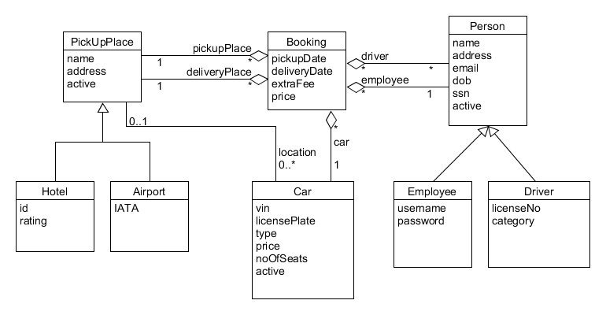
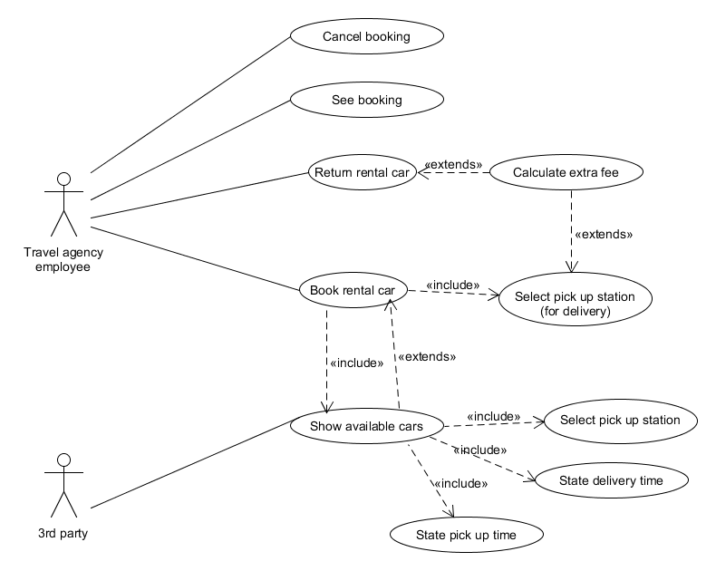

# Team C - Case 3

# Devolpment of Large Systems

Example contract repository

## Glossary

### Nouns

| Word                   | LDM | Description                      |
| :--------------------- | :-: | :------------------------------- |
| Booking System         |     |                                  |
| Rental Cars            |  x  |                                  |
| Web Service            |     |                                  |
| Web Application        |     |                                  |
| Airport                |  x  |                                  |
| Hotel                  |  x  |                                  |
| License plate          |     |                                  |
| Price                  |     |                                  |
| Number of seats        |     |                                  |
| Driver                 |  x  |                                  |
| Drivers License        |     |                                  |
| Passport               |     |                                  |
| Minimum Age            |     |                                  |
| Pick Up Station        |  x  |                                  |
| Time of pickup         |     |                                  |
| Time of delivery       |     |                                  |
| Delivery Place         |     |                                  |
| Extra fee              |     |                                  |
| Travel Agency Employee |     |                                  |
| Car Type               |  ?  | May be attributed in Car entity? |

### Verbs

| Word                     | UCM | Description                                               |
| :----------------------- | :-: | :-------------------------------------------------------- |
| Gain access to system    |  x  | aka log in                                                |
| Pick up car              |     |                                                           |
| Identify Airport         |     | Identified by IATA.                                       |
| Identify Hotel           |     | Identified by 6 digit no.                                 |
| Identify Rental Car      |     | Identified by license plate.                              |
| Identify Driver          |     | By license number and passport name. Must be >=25 yrs.    |
| Book rental car          |  x  | Must be <=3 weeks. Pick up and delivery place may differ. |
| State pickup station     |  x  | Select pickup station.                                    |
| State pickup time        |  x  |                                                           |
| State delivery time      |  x  |                                                           |
| Calculate extra fee      |  x  |                                                           |
| Move rental car          |  ?  | System should handle cars being moved.                    |
| Show list available cars |  x  | Per city per time period.                                 |
| Make booking             |  x  | See 'Book rental car'                                     |
| Return error message     |     |                                                           |
| See booking              |  x  |                                                           |
| Cancel booking           |  x  |                                                           |

## Logical Data Model

Booking er en vidensklasse der konceptuelt ikke kan eksistere uden 2 Pick Up Places, 1 bil, 1 eller flere lejer(e) og 1 udlejer.

Person har 2 specialiseringer i hhv. Employee og Driver så udlejer også kan leje en bil uden at skulle oprettes 2 gange i systemet.

PickUpPlace har 2 specialiseringer i hhv. Hotel og Airport. På denne måde kan vi senere få flere typer af pick up places.

Car.vin er en bedre måde at identificere bilen på, idet vehicle identification number må formodes at følge bilen i hele dens levetid. Hvorimod en bil på et tidspunkt kunne omregistreres.

En Car kan deaktiveres, f.eks. ved salg.
En Person kan deaktiveres, f.eks. v. ansættelsesophør eller hvis en lejer er uønsket.

PickUpPlace kan deaktiveres f.eks. hvis et hotel lukker/renoveres o. lign.

## Use Case Model

### Use case descriptions

#### UC1

**Name**: Book rental car

**Description**: Book a rental car in a specific time period from a specific pick up place.

**Primary Actor**: (Travel agency) Employee

**Preconditions**: User must be logged in.

**Main Scenario**:

1. User selects pick up station.
2. User selects pick up time.
3. User selects delivery time.
4. System list available cars.
5. User selects a car.
6. User types in driver information.
7. User saves the booking.

**Extensions**:

1. Calculate extra fee.
2. Return error message.

**Postcondition** (Success guarantees)
A booking is created.
A confirmation message is shown on screen.
A confirmation email is sent to driver.

**Alternative scenarios**

1. The selected car is unavailable in the selected time period.

**Alternative postconditions**

1. An error message is shown on screen. No booking is created.

---

#### UC2

**Name**: Cancel booking

**Description**: Cancel a saved booking.

**Primary Actor**: (Travel agency) Employee

**Preconditions**: User must be logged in. Booking has been created. Booking is upcoming.

**Main Scenario**:

1. User selects booking.
2. User cancels booking.

**Postcondition** (Success guarantees)
A booking is cancelled.
A confirmation message is shown on screen.
A confirmation email is sent to driver.

---

#### UC3

**Name**: See booking

**Description**: See details for a specific booking.

**Primary Actor**: (Travel agency) Employee

**Preconditions**: User must be logged in. Booking must exist in system.

**Main Scenario**:

1. User selects specific booking.
2. System shows booking details.

**Postcondition** (Success guarantees)
Booking details are shown.

---

#### UC4

**Name**: Show available cars

**Description**: Lists available cars based on pickup time and place.

**Primary Actor**: (Travel agency) Employee, 3rd party user

**Preconditions**: None

**Main Scenario**:

1. User selects pick up station.
2. User selects pick up time.
3. User selects delivery time.
4. System lists available cars.

**Postcondition** (Success guarantees)
A list of available cars is shown.

---

#### UC5

**Name**: Return rental car

**Description**: Register in the system that a car has been returned at a specific pick up place.

**Primary Actor**: (Travel agency) Employee

**Preconditions**: User must be logged in. Specific booking must exist and be active.

**Main Scenario**:

1. User selects booking.
2. User registers that car has been delivered.
3. System calculates extra fee if needed.
4. User ends booking.

**Extensions**:

1. Calculate extra fee.

**Postcondition** (Success guarantees)
A car is registered at a pick up place.
A booking has ended.
An extra fee may have been calculated.
A confirmation message is shown on screen.
A confirmation email is sent to driver.
