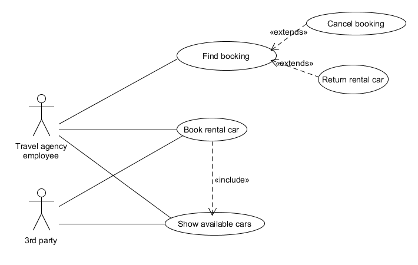

# Team C - Case 3

# Devolpment of Large Systems

Example contract repository

## Glossary

### Nouns
| Word         | LDM   | Description                           |
| :----------- | :---: | :------------------------------------ |
| Booking System|||
| Rental Cars|x||
| Web Service|||
| Web Application|||
| Airport|x||
| Hotel|x||
| License plate|||
| Price|||
| Number of seats|||
| Driver|x||
| Drivers License|||
| Passport|||
| Minimum Age|||
| Pick Up Station|x||
| Time of pickup|||
| Time of delivery|||
| Delivery Place|||
| Extra fee|||
| Travel Agency Employee|||
| Car Type|?| May be attributed in Car entity?|

### Verbs
| Word                            | UCM   | Description                           |
| :------------------------------ | :---: | :------------------------------------ |
| Gain access to system		  |   x   | aka log in| 
| Pick up car			  |       | | 
| Identify Airport	 	  |       | Identified by IATA.| 
| Identify Hotel		  |       | Identified by 6 digit no.| 
| Identify Rental Car	 	  |       | Identified by license plate.| 
| Identify Driver		  |       | By license number and passport name. Must be >=25 yrs.| 
| Book rental car		  |   x   | Must be <=3 weeks. Pick up and delivery place may differ.| 
| State pickup station		  |   x   | Select pickup station.| 
| State pickup time		  |   x   | | 
| State delivery time		  |   x   | | 
| Calculate extra fee		  |   x   | | 
| Move rental car		  |   ?   | System should handle cars being moved.| 
| Show list available cars        |   x   | Per city per time period.| 
| Make booking			  |   x   | See 'Book rental car'| 
| Return error message		  |   x   | | 
| See booking			  |   x   | | 
| Cancel booking		  |   x   | | 

## Logical Data Model

## Use Case Model

### Use case descriptions

#### UC1

##### TBD

**Name**: find course

**Description**: Find a spefic course for later updating or details

**Primary Actor**: School Admin Employee

**Preconditions**: none

**Main Scenario**:
  1. User selects find course.
  2. System shows searchform.
  3. User enters search data, and submits form.
  4. System list relevant courses
  5. User selects a course in List

**Postcondition** (Success guaranties) A specific couse is selected

**Alternative scenarios**
**Alternative postconditions**